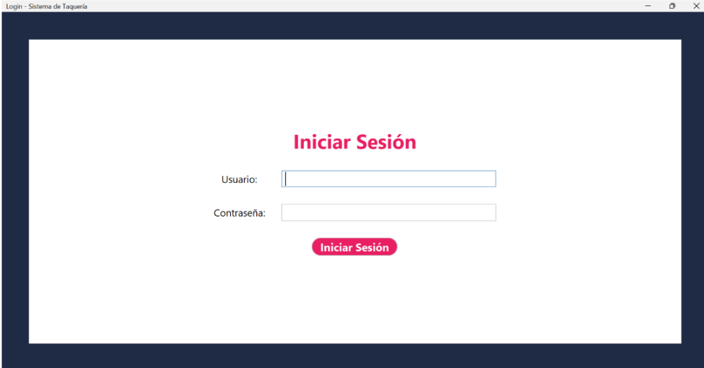
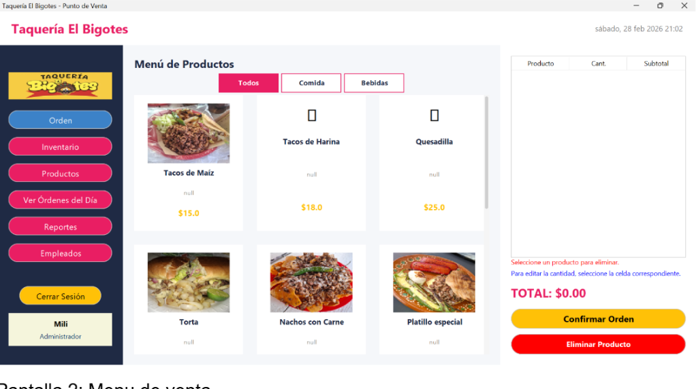
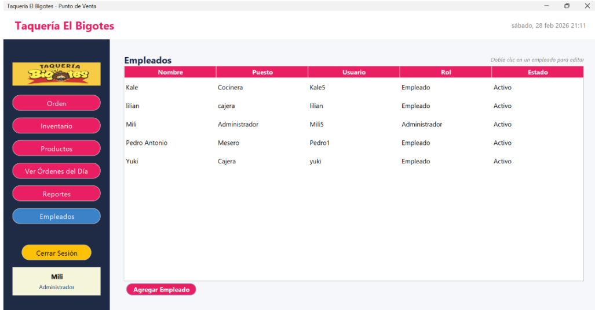
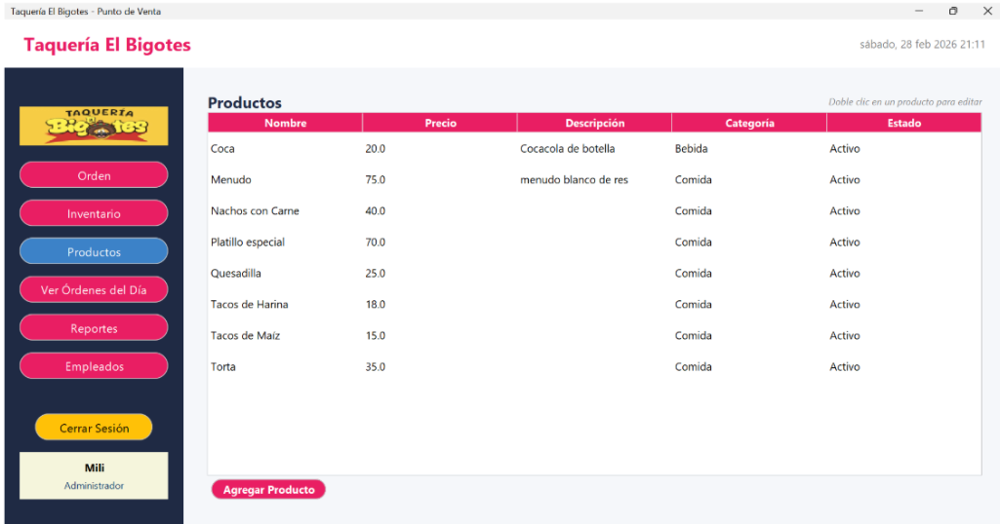
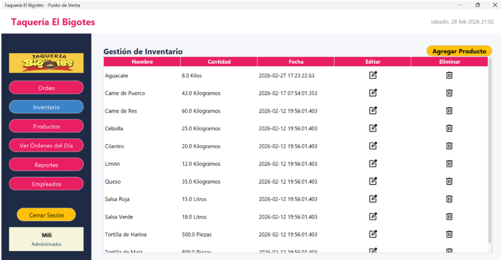
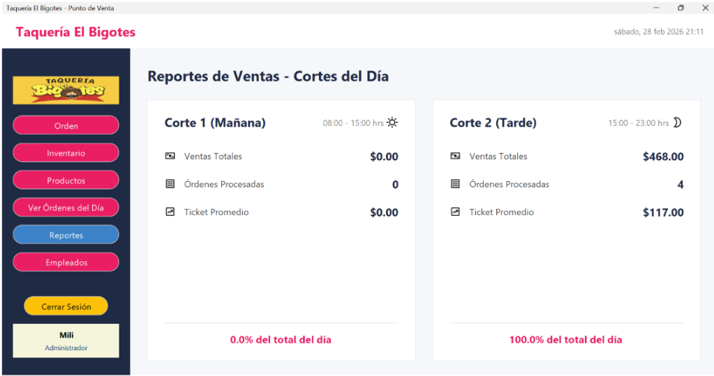

#  🌮 Sistema de Ventas "Taquería El Bigotes"
Sistema de ventas de escritorio desarrollado en Java para la gestión de productos, empleados y operaciones comerciales de la Taquería El Bigotes. Implementa arquitectura MVC, interfaz gráfica con Java Swing y conexión con SQL Server.

## Descripción

Sistema de ventas de escritorio desarrollado para la administración de los procesos internos de la **Taquería El Bigotes**.

La aplicación permite gestionar información del negocio mediante una interfaz gráfica amigable, facilitando el control de empleados, productos, inventario y ventas.

El proyecto fue desarrollado aplicando principios de **Programación Orientada a Objetos**, utilizando el patrón de arquitectura **Modelo - Vista - Controlador (MVC)** y conexión con una base de datos relacional para el almacenamiento de información.

---

##  Objetivo del proyecto

Desarrollar una solución de software empresarial que permita optimizar la gestión de una taquería mediante el registro, consulta y actualización de información relacionada con las operaciones del negocio.
El sistema busca mejorar la organización de los datos, reducir procesos manuales y proporcionar una herramienta eficiente para la administración interna.

---

##  Funcionalidades principales

-  Inicio de sesión de usuarios.
-  Administración de empleados.
-  Gestión de productos.
-  Control de inventario.
-  Registro y gestión de ventas.
-  Consulta de información almacenada.
-  Operaciones CRUD (Crear, Leer, Actualizar y Eliminar).
-  Conexión con base de datos SQL Server.

---

##  Tecnologías utilizadas

### Lenguaje de programación
- Java

### Interfaz gráfica
- Java Swing

### Base de datos
- SQL Server

### Conectividad
- JDBC

### Arquitectura de software
- Modelo - Vista - Controlador (MVC)

### Herramientas utilizadas
- NetBeans / IntelliJ IDEA
- SQL Server Management Studio
- Git y GitHub

---

##  Arquitectura del sistema

El sistema implementa el patrón de diseño **MVC (Modelo - Vista - Controlador)**, permitiendo separar las responsabilidades del software para mejorar la organización y mantenimiento del código.

### Componentes:

**Modelo**
- Maneja la estructura de los datos y la comunicación con la base de datos.

**Vista**
- Contiene las interfaces gráficas con las que interactúa el usuario.

**Controlador**
- Gestiona la comunicación entre la vista y el modelo, ejecutando las operaciones del sistema.

---
#  Capturas del sistema

##  Inicio de sesión

---

##  Pantalla principal

---

##  Gestión de empleados

---

##  Gestión de productos

---

##  Inventario

---

##  Registro de ventas

---

# Conocimientos aplicados

Durante el desarrollo del proyecto se aplicaron conocimientos relacionados con:

- Programación Orientada a Objetos.
- Análisis y modelado de software.
- Diseño de aplicaciones empresariales.
- Creación de interfaces gráficas.
- Arquitectura MVC.
- Manejo de bases de datos relacionales.
- Consultas SQL.
- Conexión entre aplicaciones Java y bases de datos.

---

# Aprendizajes del proyecto

Este proyecto permitió aplicar conocimientos del ciclo de desarrollo de software, desde el análisis de necesidades de un negocio hasta la implementación de una solución informática funcional.
Además, fortaleció habilidades en diseño de sistemas, organización del código, manejo de bases de datos y desarrollo de aplicaciones orientadas a resolver problemas reales.

---

# Autores

**Kalecxa Guadalupe Sandoval Encines**
**En colaboración de Milagros Camacho Camacho y Pedro De los Santos Aguilar**

Estudiante de Ingeniería en Sistemas Computacionales
GitHub:
[@kalest05](https://github.com/kalest05)
